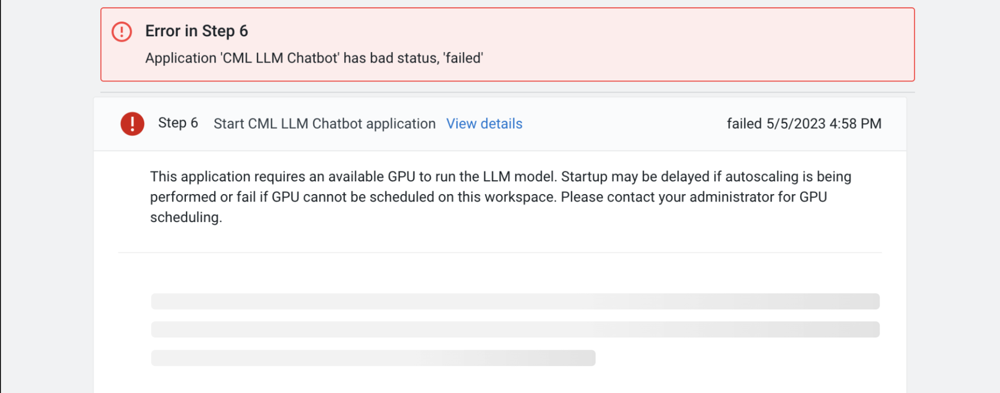
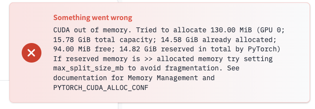
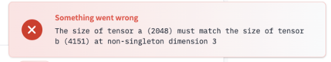

## Troubleshooting

If user quotas are enabled, ensure you have enough available quota to launch these workloads.
### AMP Failures
CML AMPs cannot be resumed or retried, please relaunch the AMP from the AMP catalog or project creation page.

#### Application Start Hanging/Failure

Application startup failure or hanging without output is most likely caused by resource limitations in your CML Workspace.

The application requires 1 GPU to perform the LLM text generation.
- Check with your CML workspace administrator to enable GPUs on your CML workspace or to adjust auto-scaling rules for GPUs.
- [CML Documentation: Autoscaling Groups](https://docs.cloudera.com/machine-learning/cloud/security/topics/ml-autoscale-groups.html)

### Text Generation Failures
#### CUDA memory

The GPU you are launching on may be too small for the LLM and text generation being performed
- Consider relaunching your application with multiple GPUs, the accelerate python package will split the workload accross both GPUs
- Also consider decreasing the size of context documentation you are trying to load, see [Limitations](#limitations)
#### Tensor Size

- The final enhanced prompt input given to the LLM is larger than the prompt limit size of the LLM
- Consider decreasing the size of context documentation you are trying to load, see [Limitations](#limitations)

### Limitations
#### Document size
- Only the first 256 tokens are considered with the included embeddings model all-MiniLM-L6-v2.
  - This means that the semantic search that occurs during context retrieval will be limited to the first 256 tokens of the document
  - The **whole document file** will still used in the context preparation in the enhanced prompt.
- If using large custom documents, it is recommended to split each document into smaller individual topic less than 500 words for better handling by the embeddings generator and to avoid Prompt Length limitations
#### Prompt Length
- The loaded LLM Model h2ogpt-oig-oasst1-512-6.9b by default will only accept prompts of size 2048 tokens
  - The total prompt length is made up of the context document retrieved, the user input, the prompt template in `4_app/llm_rag_app.py`
